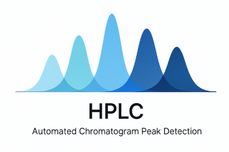

-------------------

About this Package
===================

Welcome to this HPLC package designed to work with chromatogram data
and automate peak detection and various downstream analysis. This package
is a working project, it is limited but hopefully robust enough to
accurately and efficiently work with various chromatgram data to generate
peaks and quantification.

Chromatography is an analytical technique which allows for quantitative
characterization of a chemical mixture. This process is automated these 
days, however the cleaning and process of the data generated still needs
some manual labor. This `HPLC` package is designed to eliminate most of
the manual labor so our time can be spent troubleshooting other problems.

Installation
------------
You can install `HPLC` using pip::

   $ pip install --upgrade hplc-py

Current dependencies for `HPLC` are as follows:

- Python 3.9 or newer
- NumPy_ 
- SciPy_
- Pandas_
- Seaborn_
- Tqdm_

.. _NumPy: http://www.numpy.org/
.. _SciPy: http://www.scipy.org/
.. _Pandas: http://pandas.pydata.org/
.. _tqdm: https://tqdm.github.io/
.. _Matplotlib: https://matplotlib.org/
.. _Seaborn: https://seaborn.pydata.org/

.. toctree::
   :maxdepth: 1
   :caption: Chromatography:
   :hidden:

   Using-HPLC.md
   

.. toctree::
   :maxdepth: 1
   :caption: How it works:
   :hidden:

   another-feature.md
